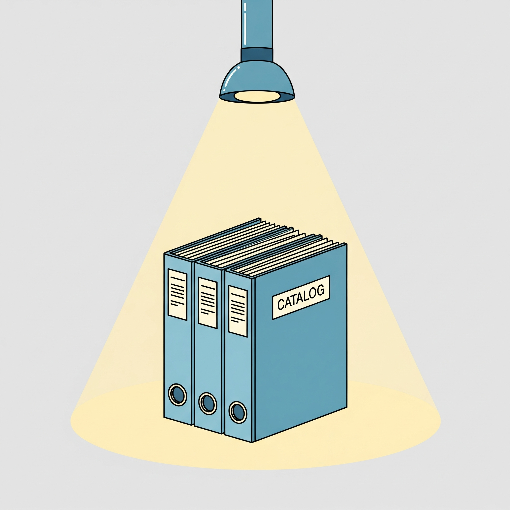

<p align="center">
  
</p>

<p align="center">
  <span style="font-size:2.5em; font-weight:bold;">lumen</span>
</p>

----

`lumen` is a command-line tool for introspecting the contents of OCI container images, with a special focus on operator-framework File-Based Catalogs (FBC). It allows you to pull catalog images, inspect and list their contents, without needing a running Kubernetes cluster.

The name "lumen" is Latin for light. More specifically, it can mean a source of light, a brightness, or an opening for light to enter, like a window. The name was chosen because the tool acts as a lens, allowing you to peer into the contents of an container image, which is otherwise an opaque container image.

## Features

-   **List Catalogs**: Find available Red Hat official and community catalog images for a specific OpenShift version.
-   **List Operators**: List all the operators available in a given catalog image.
-   **List Channels**: Show the available channels for a specific operator.
-   **List Operator Versions**: Display all the operator versions available in a specific channel.
-   **Configurable Logging**: Adjust log verbosity by using the flag `--log-level` which accepts (`debug`, `info`, `warn`, `error`).
-   **Local Caching**: Caches extracted catalog data to speed up subsequent listings.
-   **MCP Integration**: Includes an MCP (Model Context Protocol) server for AI assistant integration.

## Installation

```bash
git clone https://github.com/aguidirh/lumen.git
cd lumen
make build
```

## Usage

### List Available Catalogs
To list all available catalogs for a specific OpenShift version:
```bash
./bin/lumen list catalogs --ocp-version 4.16
```
**Output:**
```
Available OpenShift OperatorHub catalogs:
OpenShift 4.16:
registry.redhat.io/redhat/community-operator-index:v4.16
registry.redhat.io/redhat/certified-operator-index:v4.16
registry.redhat.io/redhat/redhat-operator-index:v4.16
registry.redhat.io/redhat/redhat-marketplace-index:v4.16
```

### List Packages in a Catalog
To list all available packages (operators) in a catalog:
```bash
./bin/lumen list packages --catalog registry.redhat.io/redhat/community-operator-index:v4.16
```
**Output:**
```
NAME                                        DEFAULT CHANNEL
ack-athena-controller                       alpha
ack-acmpca-controller                       alpha
...
```

### List Channels for a Package
To list all available channels for a single operator within a catalog:
```bash
./bin/lumen list channels --catalog registry.redhat.io/redhat/community-operator-index:v4.16 --package prometheus
```
**Output:**
```
NAME   HEAD
beta   prometheus-operator.v0.58.0
```

### List Bundles in a Channel
To list all available bundles (versions) for a specific channel of an operator:
```bash
./bin/lumen list bundles --catalog registry.redhat.io/redhat/community-operator-index:v4.16 --package prometheus --channel beta
```
**Output:**
```
BUNDLE_VERSION
prometheus-operator.v0.37.0
prometheus-operator.v0.38.0
prometheus-operator.v0.40.0
...
```

### Demo
[](https://asciinema.org/a/725942)

## MCP Server Integration

Lumen includes an MCP (Model Context Protocol) server that allows AI assistants to use Lumen's capabilities directly. This enables natural language queries about OpenShift operator catalogs.

### Building the MCP Server
```bash
make build-mcp
```

### Testing the MCP Server
```bash
make test-mcp
```

### Setting up with AI Assistants
See the **[MCP Setup Guide](docs/mcp/SETUP.md)** for detailed instructions on integrating with:
- Cursor IDE
- Claude Desktop
- VSCode
- Other MCP-compatible clients

## Testing

You can run the full suite of unit tests using the `make` command:

```bash
make test
```

### Test Coverage

To generate a test coverage report, run the `test-coverage` target:

```bash
make test-coverage
```

This command will create a `coverage.out` file inside the `test/coverage/` directory. You can then view the detailed, interactive HTML report by running:

```bash
make view-coverage
```

### Demo
[](https://asciinema.org/a/725992)

## Project Structure

```
lumen/
├── server/                    # MCP server implementation
│   ├── main.go               # MCP server binary
│   └── main_test.go          # MCP server tests
├── bin/                      # Built binaries
│   ├── lumen                 # Main application
│   └── mcp-server           # MCP server binary
├── internal/                 # Internal packages and integrations
│   ├── pkg/                 # Core library packages (not importable externally)
│   │   ├── catalog/         # Catalog introspection
│   │   ├── cli/             # Command-line interface
│   │   ├── fsio/            # File system operations
│   │   ├── image/           # Container image operations
│   │   ├── list/            # Listing operations
│   │   ├── log/             # Logging
│   │   └── printer/         # Output formatting
│   └── mcphandler/          # MCP handler implementation
│       └── handler.go       # MCP-to-Lumen bridge
├── docs/mcp/                # MCP documentation and configuration
│   ├── cursor-config.json   # Cursor IDE configuration
│   ├── claude-desktop-config.json  # Claude Desktop configuration
│   ├── vscode-settings.json # VSCode configuration
│   └── SETUP.md            # MCP setup and integration guide
└── Makefile                 # Build automation
```

## How It Works
`lumen` uses the `containers/image` library to interact with container registries and image layers. When you request information from a catalog that hasn't been seen before, `lumen` does the following:

1.  **Resolves Image Info**: It gets the full image reference, including the digest, to ensure it works with an immutable image version.
2.  **Pulls Image**: It copies the image to a temporary local directory in OCI layout format.
3.  **Extracts Catalog**: It inspects the image layers, looking for the File-Based Catalog (FBC) data (a directory named `configs`).
4.  **Caches Data**: Once found, it caches the `configs` directory locally in `working-dir/operator-catalogs`.
5.  **Queries Data**: It then loads the declarative configuration from the cached directory to provide you with the requested information.

Subsequent queries for the same catalog image will use the cache if the same catalog version was requested, making the process much faster.
